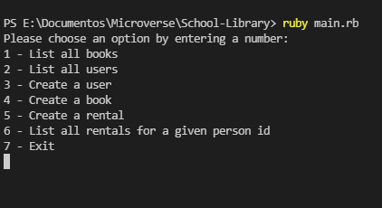

# OOP School Library

> On this repository I'll create an school library, using OOP.



On this milestone I create the basic UI using the App class and the main method to enable user interaction

## Built With

- Ruby

## Getting Started

### Prerequisites

- A code editor of your preference.
- Ruby

### Install

- Clone the repository from gitHub
```
git clone <REPO-NAME>
```

## Author

👤 **Leonardo Paz**

- Github: [Leonardo Paz](https://github.com/leolpaz)
- Twitter: [Leonardo Paz](https://twitter.com/leonardolpaz95)
- Linkedin: [Leonardo Paz](https://www.linkedin.com/in/leonardolpaz/)

## 🤝 Contributing

Contributions, issues, and feature requests are welcome!

Feel free to check the [issues page](../../issues/).

## Show your support

Give a ⭐️ if you like this project!

## 📝 License

This project is [MIT](./MIT.md) licensed.
